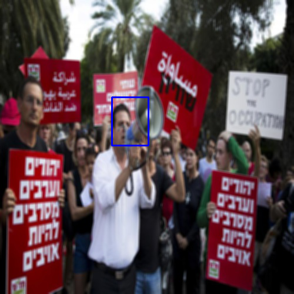
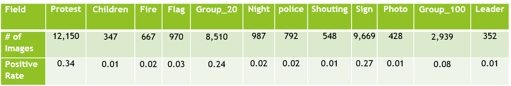
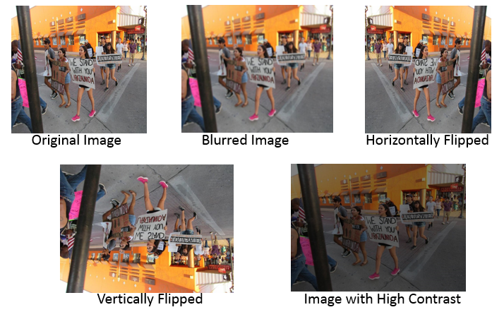
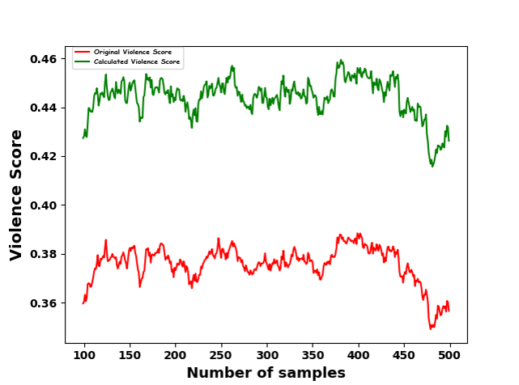
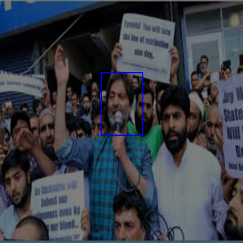

# Detection of Protest Leader and Perceived Violence Estimation from Social Media Images using Deep Learning
Implementation of the model used in the paper Protest Activity Detection and Perceived Violence Estimation from Social Media Images
(Springers) by Dibyendu Biswas, Jyoti Prakash Singh.

## Table of Contents
* [Motivation](#motivation)
* [Technologies](#technologies) 
* [Protest Image Dataset](#protest-image-dataset )
* [Models](#models)
* [Results](#results)

## Motivation
Due to inadequate security personnel and rising number of Protests around the globe, it becomes very dificult to contain violent protests.This problem is further compunded by the presence of protest Leaders who play crucial role in instigating the crowd and turning a peacful protest as violent. With the presnce of social media outlets, protest organization and highlighting has also become very easy. A novel automated system using machine learning is used to detect protest leader if present from protest images using Convolutional Neural Nets. In addition to it, a novel approach to calculate the degree of violence from visual attributes in the protest images is also proposed.   

## Technologies

* OpenCV 
* Numpy
* Keras
* Pandas
* Matplotlib
* Scikit-Learn

## Protest Image Dataset 
The dataset consist of 23,294 negative Images and 11,659 positive Images of Protest. This dataset was created by UCLA and is in their private repository. A new dataset consisting of 491 images of protest containg protest Leader and Non-Protest Leader was created by me. Images with protest Leader was lablled with a bounding box drawn around the protest leader using a manual annaotaing tool. 

### Dataset Statistics
No. of images: 35,444
No. of protest images: 12,150

### Protest & Visual Attributes

### Data Preprocessing

Since there was significant imbalance ine the dataset, various Image Augmentation techniques were employed to increase the count of the positive classes by 2. With this Augmentation the total count of positive classes increased to 24,300 and negative classes were maintained at 23,294.

## Models

3 models were used for soving this multifold task.The 1st model was used to filter out the protest from non-protest image. The second model was used to predict the presence of visual attributes from Protest Images. Violence score was calculated from these weighted visual attributes. The 3rd model was used to predict the presence of a protest leader and if present was used to localize the protest leader by drawing a bounding box around him.

## Results

The metric used for the classification task was F-Measure and for predicting the bounding box around the leader the metric used was IOU.

